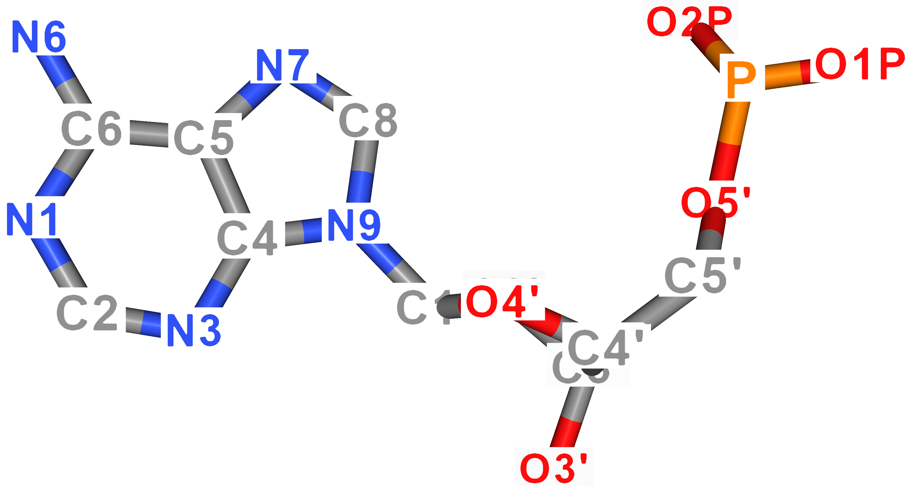
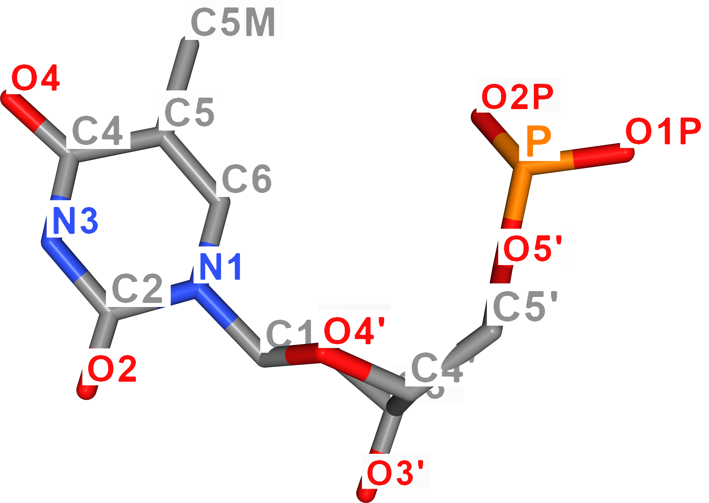
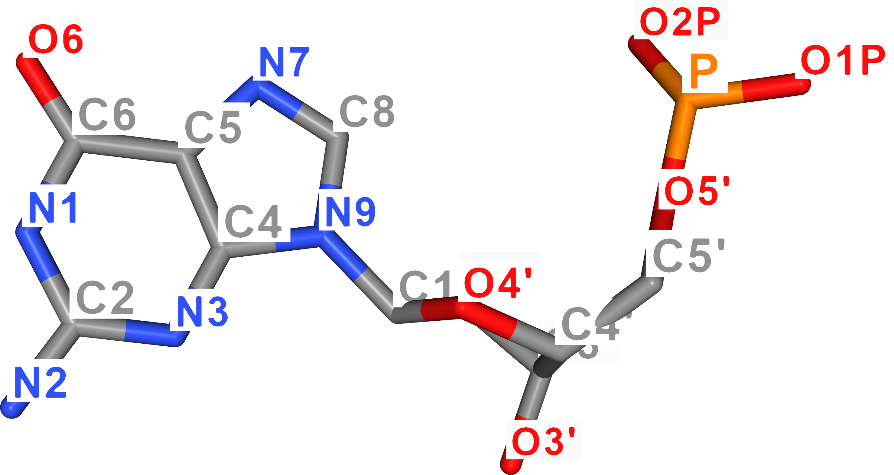
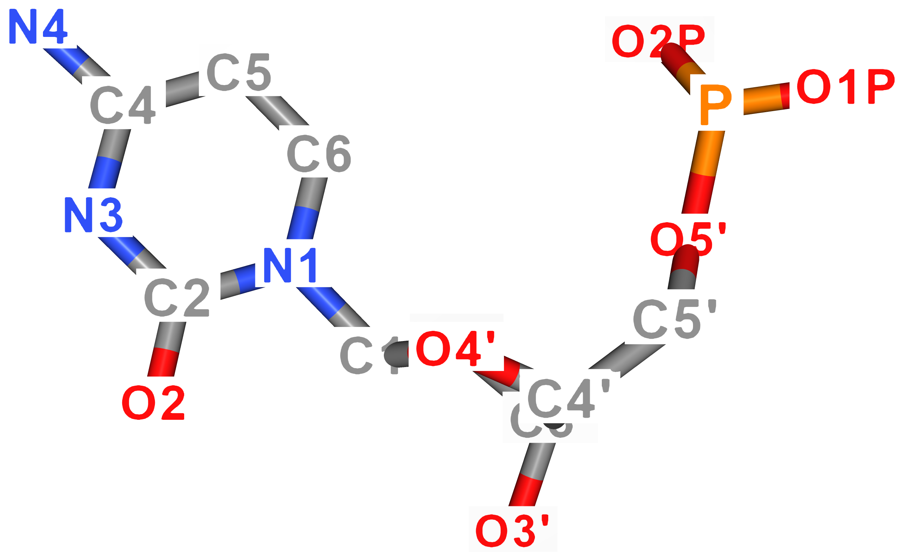

# Unified Nanotechnology Format (UNF) documentation

## Purpose
UNF aims to allow for storing of DNA nanotechnology data (for example, DNA origami lattice designs and individual free-form single strands) together with proteins and other molecules in one file.

## Version
1.0.0

## Format type
JSON-based

The core of the UNF file is pure JSON. However, due to the possibility to include other files directly in the UNF file (e.g., PDB, see field *externalFiles*), the final *.unf file cannot be always considered as a valid JSON file. However, extracting the JSON core is a straightforward task.

## General notes
Positions are stored in [x, y, z] order, units are determined by the *lengthUnits* field.  
Rotations/orientations are stored in Euler angles ("angularUnits" field determines rads/degs), values determine how much is the object rotated around each of [x, y, z] axes.  
Zero-indexing is used.

## Conventions
IDs are integers – unsigned to denote valid ID.  
To mark fields as "not used"/containing invalid value:
 - value "-1" should be used in ID-related fields (or in other fields where the meaningful values are only zero or greater)
 - empty array should be used in array-typed fields
 - empty string or "NULL" text can be used in string-based fields

## Core structure
<!--- *Note: :question: sign marks fields which are strongly "prototypical"* -->
- `string` **format:** stores the file format identification (should be always "unf")
- `string` **version:** format version string (should match MAJOR.MINOR.PATCH pattern)
- `number` **idCounter:** counter containing a value since which it is safe to assign new IDs
    - Since UNF requires most of the objects to have a unique global ID, it is important to ensure this holds when creating new data.
    - Therefore, this field is relevant mainly for design and simulation tools modifying the UNF file as it presents a safe starting point for assigning new IDs.
- `string` **lengthUnits:** determines in what length units (identified by SI symbol) are position-related data stored. 
    - *Allowed values: A (for ångström), pm (for picometer), nm (for nanometer)*
    - *Default assumed value: A*
- `string` **angularUnits:** determines the units in which angular data are stored
    - *Allowed values: deg (for degrees), rad (for radians)*
    - *Default assumed value: deg*
- `string` **name:** structure name
- `string` **author:** structure author name  
- `string` **creationDate:** structure creation date (stored in ISO 8601 standard, i.e., as YYYY-MM-DDThh:mm:ss) 
- `string` **doi:** DOI of the publication related to the structure stored in the file  
- `object` **simData:** object carrying data related to simulations
  - `[number]` **boxSize:** length of the box sides (x, y, z)
- `[object]` **externalFiles:** array of files which are referenced throughout the UNF file's content
  - `number` **id:** unique number ID
  - `string` **path:** path to the file / file name
    - If the file is not included (see *isIncluded* field), relative path starting from the location of the UNF file may be provided to reference it
    - Otherwise, the name will be used to search for the file data inside of the UNF file 
  - `boolean` **isIncluded:** boolean determining whether the file is included in this UNF file or is provided externally
    - *Including external files inside the UNF file works as follows. First, UNF JSON is saved to a file. Then, for each included external file, line with the following content: "#INCLUDED_FILE <file_name>" is present immediately followed by the content of the inserted file starting on the next line. Finally, the resulting UNF file must end with a new line.* 
  - `string` **hash:** MD5 hash of the file's content. Serves to ensure that the content of this file is the same when reading the UNF as it was when saving it. Line endings are ignored when computing hash to avoid issues related to their representation on different OSs.
- `[object]` **lattices:** array of lattices defining constrained design space
  - `number` **id:** unique ID of this lattice
  - `string` **name:** name/title of this lattice
  - `string` **type:** lattice type/layout name
    - *Allowed values: square, honeycomb*
    - *Other values may result in incompatibility between applications*
  - `[number]` **position:** world position of the lattice, corresponding to its center of mass
    - center of mass of a lattice is computed as an average of world positions of non-empty lattice cells
    - z-axis goes "into" the lattice, y-axis goes from top to bottom and x-axis from left to right.
  - `[number]` **orientation:** orientation of the lattice in space
    - the center of rotation equals to lattice's center of mass (and thus also lattice's *position*)
    - by default, lattice's z-axis is considered to be aligned with the world z-axis
  - `[object]` **virtualHelices:** array of virtual helices, i.e., lattice cells determining location and orientation of a possible double helix. Lattice may contain lots of empty cells/virtual helices (theoretically infinite), which should not be part of UNF as they carry no data.
    - `number` **id:** unique ID of this virtual helix
    - `[number]` **latticePosition:** array describing the position of this virtual helix in the lattice. For example [1, 2] refers to row 1, column 2.
    - `number` **firstActiveCell:** number of the first cell containing a nucleotide
    - `number` **lastActiveCell:** number of the last cell containing a nucleotide
    - `number` **lastCell:** number of the last cell, i.e., length of the virtual helix
    - `number` **initialAngle:** initial helical twist at the beginning of the virtual helix (used for generation of DNA helix inside this virtual helix)
    - `[object]` **cells:** array of nucleotide locations (one cell can contain up to two complementary nucleotides). Cells (cell numbers) which are not included are considered as empty.
      - `number` **id:** unique ID of this cell
      - `number` **number:** cell number (starting with zero; higher the number, the farther the cell is from the beginning of the virtual helix). Corresponds to base ID value of cadnano.<!-- - `[number]` **altPosition:** this field can determine the world position of this cell in space; can be used to override position determined by virtual helix & cell number-->
      - `string` **type:** text determining the type of the cell
        - *Allowed values: n (for normal), i (for insertion/loop), d (for deletion/skip)*
      - `[number]` **fiveToThreeNts:** IDs of the left/up (5'3' direction) nucleotides
        - For normal cell (see *type* field), this array will be empty or of length 1. For deletion, it should be empty. For insertion of length n, the array will contain n+1 values.
      - `[number]` **threeToFiveNts:** IDs of the right/down (3'5' direction) nucleotides
        - For normal cell (see *type* field), this array will be empty or of length 1. For deletion, it should be empty. For insertion of length n, the array will contain n+1 values.
- `[object]` **structures:** array of molecular structures, each of which is a set of nucleic acid strands, protein chains or combination of both
  - `number` **id:** unique ID of this structure
  - `string` **name:** name/title of this structure
  - `[object]` **naStrands:** array of individual nucleic acid single strands and their nucleotides
    - `number` **id:** unique ID of this strand
    - `string` **name:** name/title of this strand
    - `boolean` **isScaffold:** boolean determining whether this is a scaffold strand or a staple strand
    - `string` **naType:** nucleic acid type
      - *Allowed values: DNA, RNA, XNA*
    - `string` **color:** hex string storing the color for this strand
    - `number` **fivePrimeId:** ID of the 5' nucleotide
    - `number` **threePrimeId:** ID of the 3' nucleotide
        - To define circular strands, make the *threePrimeId* nucleotide *next* equal *fivePrimeId* and  *fivePrimeId* nucleotide *prev* equal *threePrimeId*
    - `number` **pdbFileId:** ID of the relevant external PDB file (for loading atomic data)
    - `string` **chainName:** name of the chain in the referenced PDB
    - `[object]` **nucleotides:** array of nucleotides of this strand
        - `number` **id:** unique ID of this nucleotide
        - `number` **nbAbbrev:** nucleobase type
          - *Allowed values: A, T, C, G, U, N*
          - N corresponds to "any base", i.e., type was not explicitly defined, following the IUPAC nucleic acid notation
        - `number` **pair:** ID of the complementary nucleotide
        - `number` **prev:** ID of the preceding nucleotide in the strand
        - `number` **next:** ID of the following nucleotide in the strand
        - `number` **pdbId:** identification of the relevant residue in the PDB file (to load atoms)
        - `[object]` **altPositions:**  An array of alternative positions of this nucleotide. By default, zeroth position is considered as the current one. More positions can be stored for dynamics/animation purposes.
          - `[number]` **nucleobaseCenter:** centroid location of the nucleobase
          - `[number]` **backboneCenter:** centroid location of the backbone 
          - `[number]` **baseNormal:** normal vector of the nucleobase plane (facing in the 5'3' direction). 
            - See *Nucleobase vectors* section of the documentation for additional information.
          - `[number]` **hydrogenFaceDir:** vector describing the direction of the face containing nucleobase's hydrogen bonds
            - See *Nucleobase vectors* section of the documentation for additional information.
  - `[object]` **aaChains:** array of protein chains
    - `number` **id:** unique ID of this chain
    - `string` **chainName:** chain name (used in the referenced PDB)
    - `string` **color:** hex string storing the color of this chain
    - `number` **pdbFileId:** ID of the relevant external PDB file
    - `number` **nTerm:** ID of the N-terminus amino acid
    - `number` **cTerm:** ID of the C-terminus amino acid
    - `[object]` **aminoAcids:** array of the amino acids of this chain
      - `number` **id:** unique ID of this amino acid
      - `string` **secondary:** string determining the secondary structure this AA is part of
      - `string` **aaAbbrev:** three-letter abbreviation of the AA name
      - `number` **prev:** ID of the preceding AA in the chain
      - `number` **next:** ID of the following AA in the chain
      - `number` **pdbId:** identification of the relevant residue in the PDB file (to load atoms)
      - `[[number]]` **altPositions:** 2D array of alternative positions, corresponding to alpha carbon location, of this AA. By default, zeroth position is considered as a current one. More positions can be stored for dynamics/animation purposes.
      <!--- Note: amino acids store only position now, any orientation/backbone direction data are now omitted. -->    
- `object` **molecules:** object containing molecules which have some position in space but we do not care about their modifications or individual parts (e.g., PDB is enough)
  - `[object]` **ligands:** array of ligands. If there are molecules storing both proteins and ligands in one file (e.g., as a PDB), they should be referenced in field *others* instead of this one.
    - `number` **id:** unique ID
    - `string` **name:** ligand name   
    - `number` **externalFileId:** ID of the relevant external file if there is any (e.g., SDF file)
    - `[object]` **atoms:** if no external file exists, the ligand can be described also as an array of atoms
      - `string` **atomName:** unique atom name
      - `string` **elementName:** element name
      - `[[number]]` **positions:** 2D array of atom's positions (offsets from ligand's *position*). By default, zeroth position is considered as a current one. More positions can be stored for dynamics/animation purposes.
    - `[object]` **bonds:** array of explicitly defined bonds between atoms
      - `string` **firstAtomName:** unique name of the first atom
      - `string` **secondAtomName:** unique name of the second atom
      - `number` **bondOrder:** bond order
      - `string` **bondType:** string identifying the type of bond
    - `[[number]]` **positions:** 2D array storing positions in space (corresponding to the ligand's center of mass). By default, zeroth position is considered as a current one. More positions can be stored for dynamics/animation purposes.
    - `[[number]]` **orientations:** 2D array storing orientations in space
  - `[object]` **nanostructures:** array of nanostructures (e.g., gold nanoparticles)
    - `number` **id:** unique ID
    - `string` **name:** nanostructure name 
    - `string` **externalFileId:** ID of the relevant external file
    - `[[number]]` **positions:** 2D array storing positions in space  
    - `[[number]]` **orientations:** 2D array storing orientations in space
  - `[object]` **others:** array of other arbitrary molecules
    - `number` **id:** unique ID
    - `string` **name:** molecule name
    - `string` **type:** molecule type
    - `number` **externalFileId:** ID of the relevant external file
    - `[[number]]` **positions:** 2D array storing positions in space
    - `[[number]]` **orientations:** 2D array storing orientations in space
- `[object]` **groups:** array with user-defined groups of particular objects
  - `number` **id:** unique ID of the group
  - `string` **name:** name of the group
  - `[number]` **includedObjects:** array with IDs of objects being part of this group
- `[object]` **connections:** array of connections between structures (namely, nucleotides and amino acids)
  - `number` **id:** unique ID of this connection
  - `[number]` **includedObjects:** array with IDs of objects being part of this connection
  - `string` **interactionType:** string describing the type of interaction (e.g., "watson-crick" for pairing in helix, "hoogsteen BP" for a tertiary contacts, ...)
- `[object]` **modifications:** array of modifications
  - `[number]` **location:** array of nucleotide/AA IDs to be modified
  - `[number]` **externalFileId:** ID of the relevant external structure file  
  - `string` **idtText:** string describing type of modification
- `[object]` **comments:** array with arbitrary textual comments/annotations/labels/remarks pertaining a specific UNF-stored object. This is a free-form field without any specific structure, aimed primarily for notes during the design and structure analysis tasks.
  - `number` **id:** unique ID of the comment
  - `number` **objectId:** ID of the commented on object  
  - `string` **content:** the text content of the comment
- `object` **misc:** object which is by default empty but should be used for storing any application-specific/domain-specific information which could not have been stored in the other fields. 

# Determining nucleotide position
The position of a nucleotide can be defined by two elements:

- Lattice
  - In lattice-based design applications, nucleotide is referenced by some cell. This cell has some location in space (defined by lattice *position*/*orientation*/*type* and cell *number*),
which is in turn also determining the location of the nucleotide itself. The intra-cell nucleotide position (with relation to its complementary base) for 3D visualizations is then based on lattice's *initialAngle*.
- Nucleotide's *altPositions* field
  - This field stores the center of mass of a nucleobase and the backbone, ready to be visualized or processed in any other way

In case both of these fields are present (i.e., the nucleotide is referenced by a lattice but also has a valid value in *altPositions*), **the *altPositions* field takes precedence for 3D visualization purposes**.

# Nucleobase vectors
Apart from storing the position of a nucleotide, UNF also stores orientation of its nucleobase.   
This information is represented by two vectors – *baseNormal* and *hydrogenFaceDir* – defining the directions along which the stacking and hydrogen bonding interactions happen. To foster compatibility with existing applications, it was opted for making these vectors correspond to the *a3* (&rarr; *baseNormal*) and *a1* (&rarr; *hydrogenFaceDir*) oxDNA vectors, as this model is already used in the field and experimentally validated [[1]](https://doi.org/10.1063/1.4921957), [[2]](https://doi.org/10.1063/1.4961398), [[3]](https://doi.org/10.1002/jcc.26029).  **The only difference is that the vector *baseNormal* is inverted compared to the *a3* since the normal goes along the 5'3' direction, while the *a3* faces the other way round.**  
In this section, the relation of these vectors to nucleotide atoms will be described in a form of a simple pseudocode (based on the conversion performed by PDB to UNF converter, which is following the [tacoxDNA](https://doi.org/10.1002/jcc.26029) scripts and the respective parts by Lorenzo Rovigatti).   
For better imagination, atom names of DNA nucleobases are visualized in the figure below. As for uracil, its ring atoms carry the same name as thymine's atoms.

| Adenine | Thymine  |
|---------|----------|
|  |  |

| Guanine | Cytosine |
|---------|----------|
|  |  |


### Vector *baseNormal*
The computation of nucleobase normal exploits planarity of base atoms to compute the result. To end up with proper direction of the normal with respect to the directionality of the strand, it is based on a precondition that O4' sugar oxygen is oriented in 3'5' direction with respect to the centre of mass of the base.

```matlab
function baseNormal(nucleobase):
    baseCom = nucleobase.centerOfMass
    parallelDir = baseCom - "O4'"
    ringAtoms = ["C2", "C4", "C5", "C6", "N1", "N3"]
    bn = (0, 0, 0)
    
    foreach permutation (p,q,r) from ringAtoms:
        v1 = normalize(p - q)
        v2 = normalize(p - r)        
        tmp = normalize(v1×v2)
        if tmp•parallelDir < 0:
          negate(tmp)
        bn += tmp
    
    return normalize(bn)
```

### Vector *hydrogenFaceDir*
The idea of computing hydrogen face direction lies in adding together three vectors, of which each faces roughly along the hydrogen bonding direction, followed by normalization of the result.

```matlab
function hydrogenFaceDir(nucleobase):
    if nucleobase is purine:
        v1 = vector from "C4" to "N1"
        v2 = vector from "N3" to "C2"
        v3 = vector from "C5" to "C6"
    else:
        v1 = vector from "C6" to "N3"
        v2 = vector from "N1" to "C2"
        v3 = vector from "C5" to "C4"
    
    v = v1 + v2 + v3
    return normalize(v)
```
### Short-axis of the base-pair
To properly define the vector space / basis of the nucleobase, three vectors are needed. In case of UNF, the third vector goes along the short-axis of the base-pair. In other words, from one groove side to another.  
To compute this vector, a simple cross product of the two abovementioned ones is needed.

```matlab
function basePairShortAxis(nucleobase):
    return hydrogenFaceDir(nucleobase) × baseNormal(nucleobase)
```

# UNF Viewer documentation
The UNF Viewer is written in JavaScript and Three.js library.    
It enables to visualize the content of a UNF file by selecting the desired file from the file dialog.  
**At the moment, only a subset of UNF fields and properties is visualized. Mainly "lattices", "structures", and "molecules.others". When previewing the UNF file content, keep this fact in mind.**  
To run it, clone the repository and use, e.g., live server to host the viewer application. It is recommended to refresh/reload (typically F5) the application before loading a new strucutre.    
Since it is written in JavaScript, it cannot search your hard drive; in other words, you need to upload not just the UNF file but also all files referenced in the "externalFiles" field which are not included directly in the UNF file. If a PDB file is not included nor uploaded, the viewer automatically tries to download it from RCSB.  
The application serves mainly for UNF development purposes right now, it is, therefore, recommended to have a dev console open to see the console logs.  

# Converters documentation
- **Cadnano to UNF converter (Python)**
  - Converts given cadnano (< v2.5) files to a single UNF file
  - Circular scaffolds are processed by performing a cut at predefined location.
  - Loops are converted to an "insertion" cell referencing corresponding number of nucleotides.
  - Skips are converted to a "deletion" cell referencing no nucleotides.

- **PDB to UNF converter (Python)**
  - Converts given PDB file to a single UNF file.
  - The conversions takes all-atom details of (D)(R)NAs, proteins, and ligands in PDB and converts them to a coarse-grained representation stored in the UNF.

- **UNF to Cadnano converter (Python)**
  - Converts given UNF file to one or more Cadnano files, one for each UNF-stored lattice.
  - The conversion does not convert colors at the moment.
  - Insertions are converted to Cadnano loops. Deletions are currently not converted to Cadnano skips (aka "red crosses") but the strands itself skip the corresponding cells in Cadnano so the information remains preserved.

# Other scripts documentation

- **Add PDB to UNF (Python)**
  - Attaches given PDB structure to a UNF file
  - The structure is attached "as is" (in a full atomistic detail) without any conversions
  - The structure can be positioned at desirated location in space

# Applications implementing UNF
  - oxView: [GitHub](https://github.com/sulcgroup/oxdna-viewer/) / [Application](https://sulcgroup.github.io/oxdna-viewer/) 
